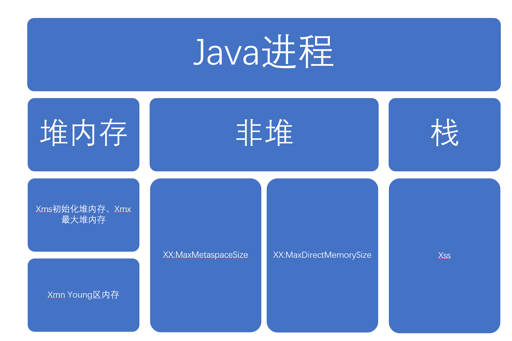

[TOC]
# 第一题
1. 找到一个曾经编写过的Java程序，编译后得到以下字节码，[Java文件](./Hello.java)
```
javap -c -verbose ./Hello.class
Classfile /D:/codes/java/homework_java/src/com/cxp/week01/Hello.class
  Last modified 2022年5月8日; size 987 bytes
  SHA-256 checksum 8dee027a7be4e52df6349af49fb624f12ddebda6df0f9e9983ce2df7d48bdf44
  Compiled from "Hello.java"
public class com.cxp.week01.Hello
  minor version: 0
  major version: 61
  flags: (0x0021) ACC_PUBLIC, ACC_SUPER
  this_class: #29                         // com/cxp/week01/Hello
  super_class: #2                         // java/lang/Object
  interfaces: 0, fields: 0, methods: 3, attributes: 1
Constant pool:
   #1 = Methodref          #2.#3          // java/lang/Object."<init>":()V
   #2 = Class              #4             // java/lang/Object
   #3 = NameAndType        #5:#6          // "<init>":()V
   #4 = Utf8               java/lang/Object
   #5 = Utf8               <init>
   #6 = Utf8               ()V
   #7 = Class              #8             // "[[[I"
   #8 = Utf8               [[[I
   #9 = Integer            -1000000
  #10 = Methodref          #11.#12        // java/util/Arrays.fill:([II)V
  #11 = Class              #13            // java/util/Arrays
  #12 = NameAndType        #14:#15        // fill:([II)V
  #13 = Utf8               java/util/Arrays
  #14 = Utf8               fill
  #15 = Utf8               ([II)V
  #16 = Methodref          #17.#18        // java/lang/Math.max:(II)I
  #17 = Class              #19            // java/lang/Math
  #18 = NameAndType        #20:#21        // max:(II)I
  #19 = Utf8               java/lang/Math
  #20 = Utf8               max
  #21 = Utf8               (II)I
  #22 = Fieldref           #23.#24        // java/lang/System.out:Ljava/io/PrintStream;
  #23 = Class              #25            // java/lang/System
  #24 = NameAndType        #26:#27        // out:Ljava/io/PrintStream;
  #25 = Utf8               java/lang/System
  #26 = Utf8               out
  #27 = Utf8               Ljava/io/PrintStream;
  #28 = Methodref          #29.#30        // com/cxp/week01/Hello.maxProfit:([I)I
  #29 = Class              #31            // com/cxp/week01/Hello
  #30 = NameAndType        #32:#33        // maxProfit:([I)I
  #31 = Utf8               com/cxp/week01/Hello
  #32 = Utf8               maxProfit
  #33 = Utf8               ([I)I
  #34 = Methodref          #35.#36        // java/io/PrintStream.println:(I)V
  #35 = Class              #37            // java/io/PrintStream
  #36 = NameAndType        #38:#39        // println:(I)V
  #37 = Utf8               java/io/PrintStream
  #38 = Utf8               println
  #39 = Utf8               (I)V
  #40 = Utf8               Code
  #41 = Utf8               LineNumberTable
  #42 = Utf8               StackMapTable
  #43 = Class              #44            // "[I"
  #44 = Utf8               [I
  #45 = Utf8               main
  #46 = Utf8               ([Ljava/lang/String;)V
  #47 = Utf8               SourceFile
  #48 = Utf8               Hello.java
{
  public com.cxp.week01.Hello();
    descriptor: ()V
    flags: (0x0001) ACC_PUBLIC
    Code:
      stack=1, locals=1, args_size=1
         0: aload_0
         1: invokespecial #1                  // Method java/lang/Object."<init>":()V
         4: return
      LineNumberTable:
        line 5: 0

  public static int maxProfit(int[]);
    descriptor: ([I)I
    // 静态Public方法
    flags: (0x0009) ACC_PUBLIC, ACC_STATIC
    Code:
      stack=6, locals=6, args_size=1
         // 从本地变量表中加载参数放入操作数栈
         0: aload_0
         // 得到数组的长度放入操作数栈
         1: arraylength
         // 定义一个常量1放入操作数栈
         2: iconst_1
         // 将操作数栈中的两个数相加并放入操作数栈
         3: iadd
         // 创建一个指定长度的数组放入操作数栈
         4: newarray       int
         // 将该数组保存到本地变量表1
         6: astore_1
         // 在操作数栈中定义一个常量1
         7: iconst_1
         // 放入本地变量表2
         8: istore_2
         // 加载本地变量表2
         9: iload_2
         // 加载本地变量表1（之前创建的数组）
        10: aload_1
        // 将数组的长度放入操作数栈
        11: arraylength
        // 比较iload_2加载的变量是否大于等于数组的长度
        12: if_icmpge     29
        // 将本地变量表1中的数组加载到操作数栈
        15: aload_1
        // 将本地变量表2的整数加载到操作数栈
        16: iload_2
        // 将本地变量表0中的数据加载到操作数栈
        17: aload_0
        // 将本地变量表2中的整数加载到操作数栈
        18: iload_2
        // 定义一个常量1
        19: iconst_1
        // 将两个整数相减，并放入本地变量表1
        20: isub
        // 从0数组中使用整数加载出一个元素
        21: iaload
        // 保存到数组1
        22: iastore
        // 将变量2自增1
        23: iinc          2, 1
        // 跳到第9行
        26: goto          9
        // 循环结束
        29: aload_1
        30: arraylength
        31: iconst_2
        32: iconst_2
        33: multianewarray #7,  3             // class "[[[I"
        37: astore_2
        38: aload_2
        39: iconst_0
        40: aaload
        41: iconst_0
        42: aaload
        43: ldc           #9                  // int -1000000
        45: invokestatic  #10                 // Method java/util/Arrays.fill:([II)V
        48: aload_2
        49: iconst_0
        50: aaload
        51: iconst_1
        52: aaload
        53: ldc           #9                  // int -1000000
        55: invokestatic  #10                 // Method java/util/Arrays.fill:([II)V
        58: aload_2
        59: iconst_0
        60: aaload
        61: iconst_0
        62: aaload
        63: iconst_0
        64: iconst_0
        65: iastore
        66: iconst_1
        67: istore_3
        68: iload_3
        69: aload_1
        70: arraylength
        71: if_icmpge     220
        74: aload_2
        75: iload_3
        76: aaload
        77: iconst_0
        78: aaload
        79: ldc           #9                  // int -1000000
        81: invokestatic  #10                 // Method java/util/Arrays.fill:([II)V
        84: aload_2
        85: iload_3
        86: aaload
        87: iconst_1
        88: aaload
        89: ldc           #9                  // int -1000000
        91: invokestatic  #10                 // Method java/util/Arrays.fill:([II)V
        94: aload_2
        95: iload_3
        96: aaload
        97: iconst_1
        98: aaload
        99: iconst_0
       100: aload_2
       101: iload_3
       102: aaload
       103: iconst_1
       104: aaload
       105: iconst_0
       106: iaload
       107: aload_2
       108: iload_3
       109: iconst_1
       110: isub
       111: aaload
       112: iconst_0
       113: aaload
       114: iconst_0
       115: iaload
       116: aload_1
       117: iload_3
       118: iaload
       119: isub
       120: invokestatic  #16                 // Method java/lang/Math.max:(II)I
       123: iastore
       124: aload_2
       125: iload_3
       126: aaload
       127: iconst_0
       128: aaload
       129: iconst_1
       130: aload_2
       131: iload_3
       132: aaload
       133: iconst_0
       134: aaload
       135: iconst_1
       136: iaload
       137: aload_2
       138: iload_3
       139: iconst_1
       140: isub
       141: aaload
       142: iconst_1
       143: aaload
       144: iconst_0
       145: iaload
       146: aload_1
       147: iload_3
       148: iaload
       149: iadd
       150: invokestatic  #16                 // Method java/lang/Math.max:(II)I
       153: iastore
       154: iconst_0
       155: istore        4
       157: iload         4
       159: iconst_2
       160: if_icmpge     214
       163: iconst_0
       164: istore        5
       166: iload         5
       168: iconst_2
       169: if_icmpge     208
       172: aload_2
       173: iload_3
       174: aaload
       175: iload         4
       177: aaload
       178: iconst_0
       179: aload_2
       180: iload_3
       181: aaload
       182: iload         4
       184: aaload
       185: iconst_0
       186: iaload
       187: aload_2
       188: iload_3
       189: iconst_1
       190: isub
       191: aaload
       192: iload         4
       194: aaload
       195: iload         5
       197: iaload
       198: invokestatic  #16                 // Method java/lang/Math.max:(II)I
       201: iastore
       202: iinc          5, 1
       205: goto          166
       208: iinc          4, 1
       211: goto          157
       214: iinc          3, 1
       217: goto          68
       220: aload_2
       221: aload_1
       222: arraylength
       223: iconst_1
       224: isub
       225: aaload
       226: iconst_0
       227: aaload
       228: iconst_1
       229: iaload
       230: aload_2
       231: aload_1
       232: arraylength
       233: iconst_1
       234: isub
       235: aaload
       236: iconst_0
       237: aaload
       238: iconst_0
       239: iaload
       240: invokestatic  #16                 // Method java/lang/Math.max:(II)I
       243: ireturn
      LineNumberTable:
        line 7: 0
        line 8: 7
        line 9: 15
        line 8: 23
        line 11: 29
        line 12: 38
        line 13: 48
        line 14: 58
        line 16: 66
        line 17: 74
        line 18: 84
        line 19: 94
        line 20: 124
        line 21: 154
        line 22: 163
        line 23: 172
        line 22: 202
        line 21: 208
        line 16: 214
        line 28: 220
      StackMapTable: number_of_entries = 8
        frame_type = 253 /* append */
          offset_delta = 9
          locals = [ class "[I", int ]
        frame_type = 250 /* chop */
          offset_delta = 19
        frame_type = 253 /* append */
          offset_delta = 38
          locals = [ class "[[[I", int ]
        frame_type = 252 /* append */
          offset_delta = 88
          locals = [ int ]
        frame_type = 252 /* append */
          offset_delta = 8
          locals = [ int ]
        frame_type = 250 /* chop */
          offset_delta = 41
        frame_type = 250 /* chop */
          offset_delta = 5
        frame_type = 250 /* chop */
          offset_delta = 5

  public static void main(java.lang.String[]);
    descriptor: ([Ljava/lang/String;)V
    flags: (0x0009) ACC_PUBLIC, ACC_STATIC
    Code:
      stack=4, locals=2, args_size=1
         0: iconst_5
         1: newarray       int
         3: dup
         4: iconst_0
         5: iconst_1
         6: iastore
         7: dup
         8: iconst_1
         9: iconst_2
        10: iastore
        11: dup
        12: iconst_2
        13: iconst_3
        14: iastore
        15: dup
        16: iconst_3
        17: iconst_0
        18: iastore
        19: dup
        20: iconst_4
        21: iconst_2
        22: iastore
        23: astore_1
        24: getstatic     #22                 // Field java/lang/System.out:Ljava/io/PrintStream;
        27: aload_1
        28: invokestatic  #28                 // Method maxProfit:([I)I
        31: invokevirtual #34                 // Method java/io/PrintStream.println:(I)V
        34: return
      LineNumberTable:
        line 32: 0
        line 33: 24
        line 34: 34
```
# 第二题
[Java文件](./XClassLoader.java)
# 第三题
